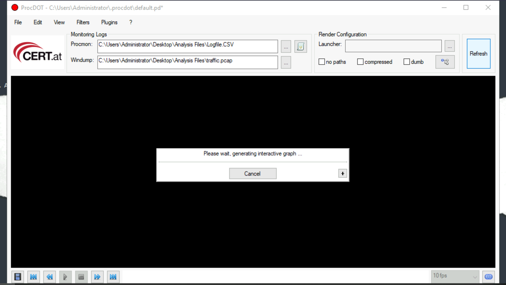
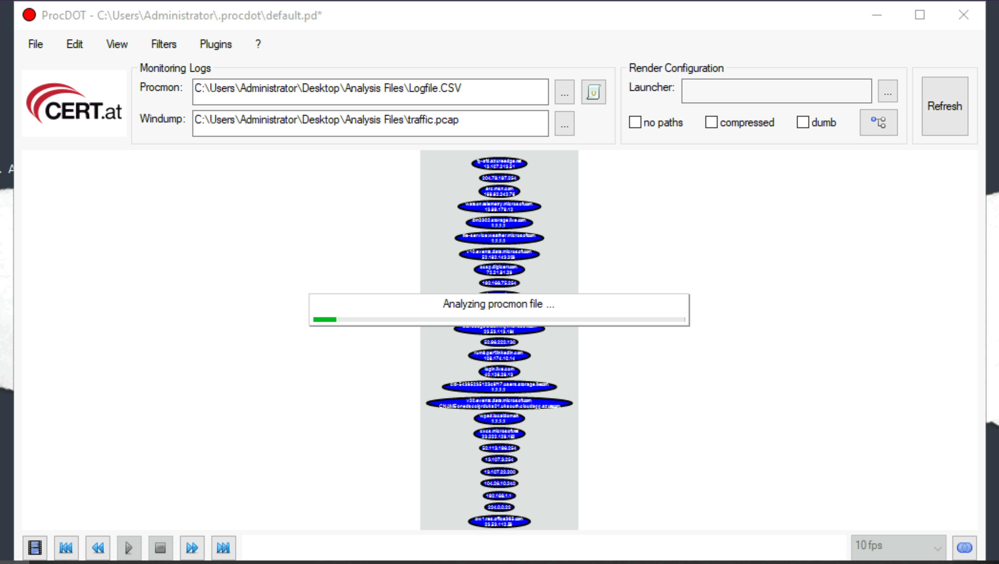
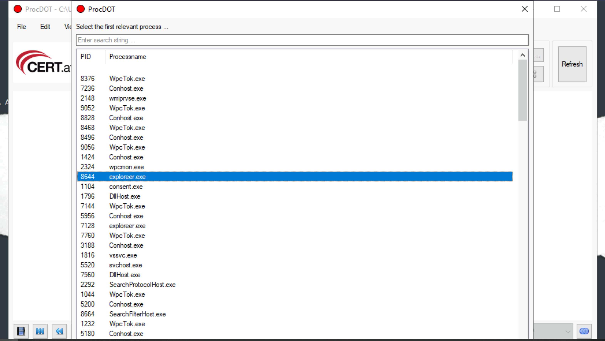
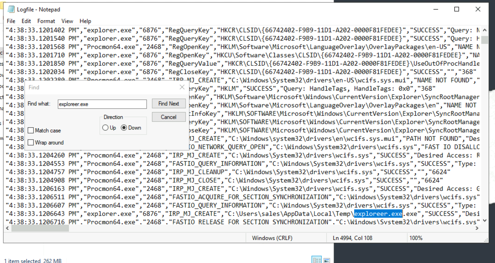
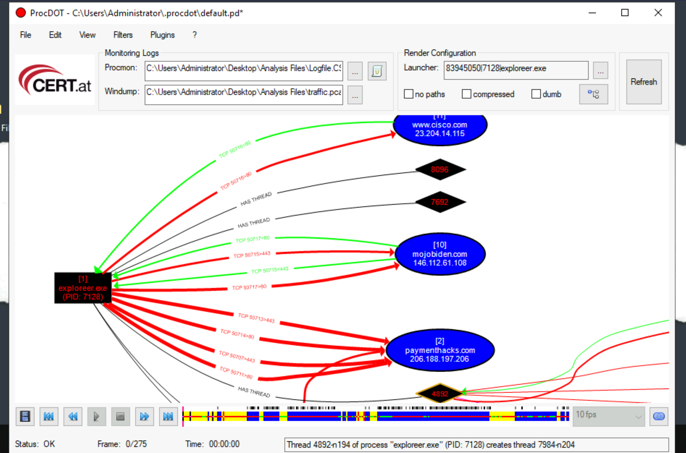
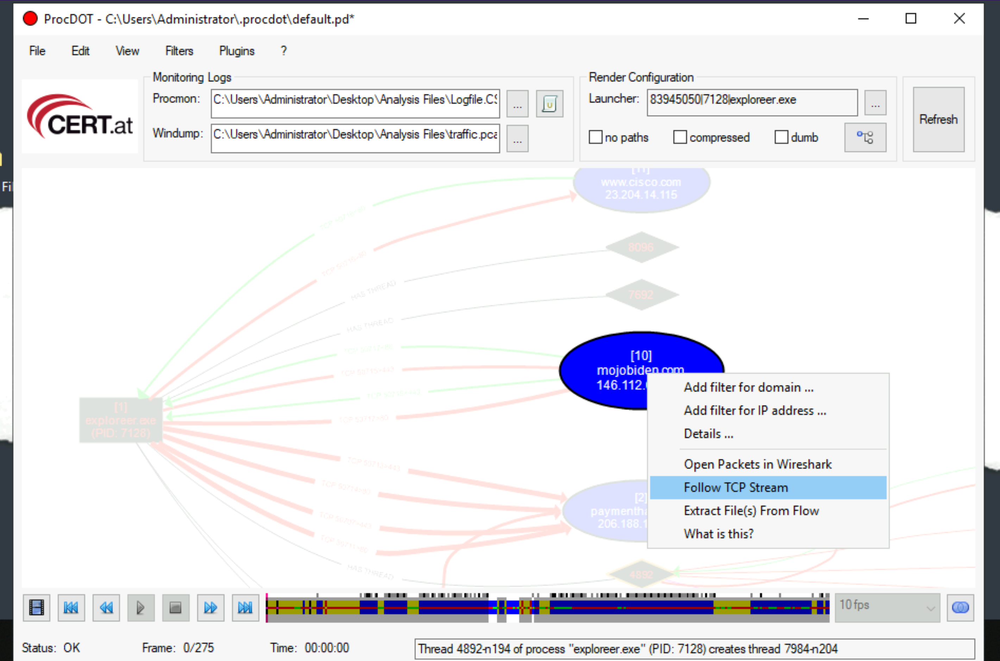
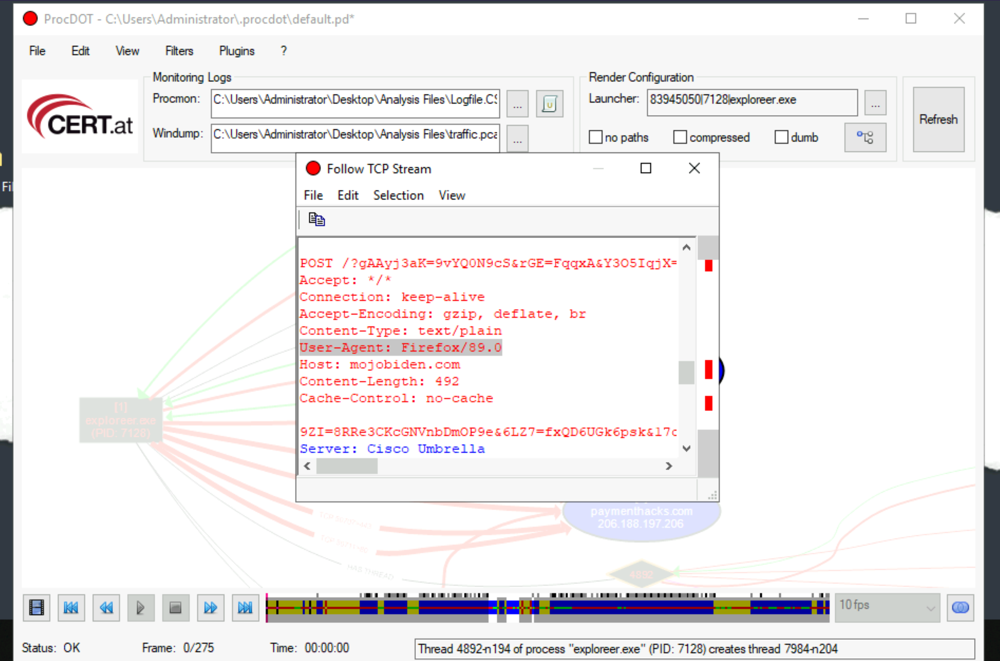
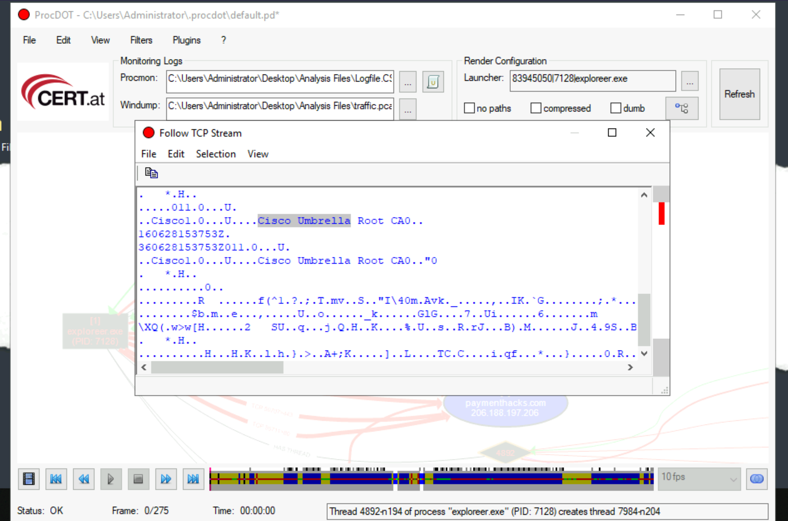
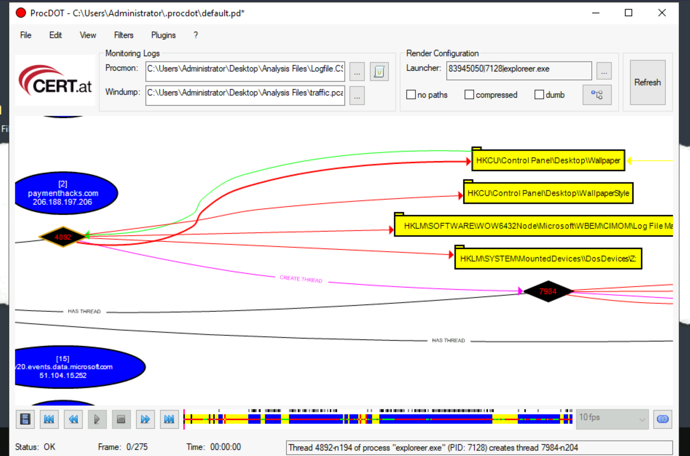

| 
|:--:|
| [THM Room: Dunkle Materie](https://tryhackme.com/room/dunklematerieptxc9) |

# THM Dunkle Materie

The firewall alerted the Security Operations Center that one of the machines at the Sales department, which stores 
all the customers' data, contacted the malicious domains over the network. When the Security Analysts looked closely, 
the data sent to the domains contained suspicious base64-encoded strings. The Analysts involved the Incident Response 
team in pulling the Process Monitor and network traffic data to determine if the host is infected. But once they got 
on the machine, they knew it was a ransomware attack by looking at the wallpaper and reading the ransomware note.

Find more evidence of compromise on the host and what ransomware was involved in the attack.

| 
|:--:|
| Upload the `Logfile.CSV` and `traffic.pcap` files from the `Analysis Files` to `ProcDot` and  click `Refresh`. |

## Questions

**Provide the two PIDs spawned from the malicious executable. (In the order as they appear in the analysis tool)**

| 
|:--:|
| Click on the `...` `Launcher` button to select a process from the list. |

| 
|:--:|
| A list of processes that were active while `procmon` was monitoring will appear with the PIDS. |

**Provide the full path where the ransomware initially got executed? (Include the full path in your answer)**

| 
|:--:|
| Open the "LogFile.csv" file in notepad and search for `exploreer.exe`. |

**This ransomware transfers the information about the compromised system and the encryption results to two domains 
over `HTTP POST`. What are the two `C2` domains? (no space in the answer)**

**What are the IPs of the malicious domains? (no space in the answer)**

| 
|:--:|
| Double-click on the second instance of the malicious process (`7128`) and `Refresh`. Scroll through the  captured data to find where `exploreer.exe` is sending and receiving a stream of TCP traffic. |

**Provide the user-agent used to transfer the encrypted data to the C2 channel.**

| 
|:--:|
| Right-click on the `mojobiden` server and click `Follow TCP Stream`. |

| 
|:--:|
| Scroll down until you see information in red text with the `User-Agent` information. |

**Provide the cloud security service that blocked the malicious domain.**

| 
|:--:|
| Right-click on the Cisco Server bubble, `Follow TCP Stream`. |

**Provide the name of the bitmap that the ransomware set up as a desktop wallpaper.**

Search for `.bmp` in the file `LogFile.csv` using `Notepad`.

**Find the PID (Process ID) of the process which attempted to change the background wallpaper on the victim's machine.**

**The ransomware mounted a drive and assigned it a letter. Provide the registry key path to the mounted drive, including the drive letter.**

| 
|:--:|
| Follow thread `4892` created by `7128` to find path `HKCU\Control Panel\Desktop\Wallpaper`   and the registry path for the mounted device. |

**Now you have collected some IOCs from this investigation. Provide the name of the ransomware used in the attack. (external research required)**

Look up the found `C2` servers on sites like VirusTotal and AlienVault to find the name of the Ransomware.

Dat's it.
